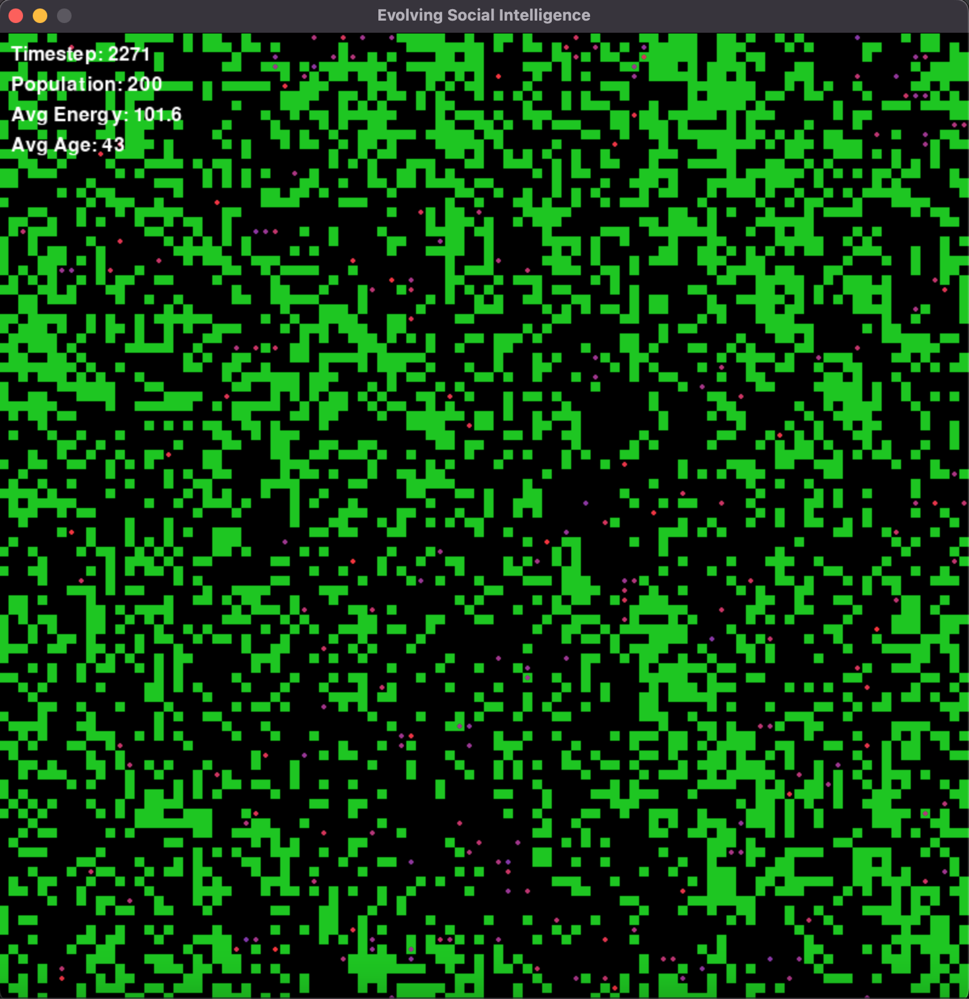

# Evolving Social Intelligence

An open-ended evolutionary simulation where AI agents develop intelligence through social interaction, recapitulating the environmental and social pressures that shaped biological intelligence on Earth.

## What This Is

This project creates a minimal but complete artificial life simulation where:

- **Neural network agents** with simple brains (52 inputs → 32 hidden → 6 outputs) perceive their local environment and make movement decisions
- **Evolution drives adaptation** through asexual reproduction with mutation, natural selection, and energy-based survival
- **Emergent behaviors** arise from agents learning to forage for food, avoid starvation, and reproduce successfully
- **Social capabilities** are built-in but dormant, waiting for environmental complexity to make them useful (communication signals, resource transfer, memory)

The simulation runs on a 2D toroidal grid where agents must:
- Find and consume food to maintain energy
- Manage metabolic costs of movement and survival
- Reproduce when they gather enough energy
- Pass mutated versions of their neural networks to offspring

**Core Philosophy**: Rather than engineering intelligent behaviors, we provide agents with latent capabilities and let evolution discover which strategies work through millions of timesteps of trial and error.

## Key Features

- **Fast NumPy-based simulation**: 150+ timesteps/second without visualization
- **Real-time Pygame visualization**: Watch evolution happen with color-coded agents and live stats
- **Configurable parameters**: Easy YAML configs for grid size, population, mutation rates, energy dynamics
- **Comprehensive metrics**: Population tracking, births/deaths, energy levels, ages, and more
- **Behavioral analytics**: Movement efficiency, food discovery rates, and action entropy logged alongside population stats
- **Lineage tracking**: Periodic ancestry snapshots with dominant lineages and diversity indices
- **Spatial optimization**: O(1) agent lookup using grid-based spatial indexing

## Project Status

This is an **early-stage research project** (Phase 1: MVP complete). Current capabilities:
- ✅ Basic foraging and survival
- ✅ Evolutionary dynamics working
- ✅ Stable populations over thousands of timesteps
- 🚧 Social behaviors (communication, cooperation) not yet emerged
- 🚧 Long-term experiments (millions of timesteps) in progress

Future directions: environmental complexity, predator-prey dynamics, richer social interactions, open-ended evolution.

## Quick Demo


*Agents (colored circles) navigate a grid world, consuming food (green squares) and evolving over time.*

---
## System Dependencies

Before installing Python dependencies, you need to install SDL2 libraries:

### Ubuntu/Debian:
```bash
sudo apt-get update
sudo apt-get install python3-dev libsdl2-dev libsdl2-image-dev libsdl2-mixer-dev libsdl2-ttf-dev libfreetype6-dev
```

### macOS (with Homebrew):
```bash
brew install sdl2 sdl2_image sdl2_mixer sdl2_ttf freetype
```

### Fedora/RHEL:
```bash
sudo dnf install python3-devel SDL2-devel SDL2_image-devel SDL2_mixer-devel SDL2_ttf-devel freetype-devel
```


## Setup and Installation

### Prerequisites

- Python 3.10 or higher (3.13 recommended)
- pip package manager
- ~50MB disk space for dependencies

### Installation Steps

1. **Clone or download this repository**:
```bash
git clone https://github.com/jabbarman/evolving-social-intelligence.git
cd evolving-social-intelligence
```

2. **Create a virtual environment** (recommended):
```bash
python3 -m venv .venv
source .venv/bin/activate  # On Windows: .venv\Scripts\activate
```

3. **Install dependencies**:
```bash
pip install -r requirements.txt
```

This installs:
- `numpy` - Fast numerical computing
- `pygame` - Real-time visualization
- `matplotlib` - Plotting and analysis
- `pandas` - Data manipulation
- `pyyaml` - Configuration files
- `tqdm` - Progress bars

**Note**: PyTorch is listed in requirements but optional. The project uses NumPy for neural networks due to Python 3.13 compatibility. If you're on Python 3.11 or earlier and want GPU acceleration, you can install PyTorch separately, but it's not required.

### Verify Installation

Run a quick test to make sure everything works:
```bash
python3 main.py --config configs/fast_test.yaml --steps 100 --no-viz
```

You should see output like:
```
Loaded config from configs/fast_test.yaml
Grid size: [50, 50]
Initial population: 20
Population cap: 100

Simulation initialized with 20 agents
Running for 100 timesteps...
Simulating: 100%|██████████| 100/100 [00:00<00:00, 150.23it/s]

==================================================
Simulation completed!
Final timestep: 100
Final population: 65
Metrics saved to experiments/logs
```

---

## Running Simulations

### Basic Usage

**Run with real-time visualization** (30 FPS):
```bash
python3 main.py
```

**Run fast without visualization**:
```bash
python3 main.py --no-viz
```

**Run for specific number of timesteps**:
```bash
python3 main.py --steps 5000
```

**Use a custom configuration**:
```bash
python3 main.py --config configs/fast_test.yaml
```

**Combine options**:
```bash
python3 main.py --config configs/fast_test.yaml --steps 10000 --no-viz
```

### Checkpointing and Resuming Runs

- The simulation periodically writes compressed checkpoints to `experiments/logs/checkpoints/` (or the `logging.save_dir` you configure). The cadence is set by `logging.checkpoint_interval`; set it to `0` to disable automatic saves.
- Hitting `Ctrl+C` during a run also triggers a best-effort checkpoint before the program exits, so long-running experiments can stop safely.
- Resume from any checkpoint file with the new `--resume-from` flag:

```bash
python3 main.py --resume-from experiments/logs/checkpoints/checkpoint_00050000.pkl.gz --no-viz
```

The configuration stored in the checkpoint is restored automatically. Values under `logging` can still be overridden by the config you pass via `--config`.

### Available Configurations

- `configs/default.yaml` - Standard setup (100x100 grid, 50 agents, 200 cap)
- `configs/fast_test.yaml` - Smaller setup for quick experiments (50x50 grid, 20 agents, 100 cap)

### Creating Custom Configs

Copy and modify an existing config file:

```yaml
simulation:
  grid_size: [100, 100]        # World dimensions
  max_timesteps: 1000000       # Default run length
  population_cap: 200          # Max agents allowed
  initial_population: 50       # Starting agents
  seed: 42                     # Random seed (reproducibility)

environment:
  food_spawn_rate: 0.01        # Probability per cell per timestep
  food_energy_value: 10        # Energy gained from food

agent:
  initial_energy: 100          # Starting energy
  base_metabolic_cost: 1.0     # Energy lost per timestep (always)
  movement_cost: 0.1           # Additional cost when moving
  perception_range: 2          # Cells visible (2 = 5x5 grid)
  reproduction_threshold: 150  # Energy needed to reproduce
  reproduction_cost: 80        # Energy given to offspring

evolution:
  mutation_rate: 0.1           # Fraction of weights mutated
  mutation_std: 0.1            # Size of mutations

logging:
  log_interval: 1000           # Record metrics every N steps
  save_dir: experiments/logs

behavioral_metrics:
  enabled: true                # Toggle behavioral metric logging
  movement_history_length: 20  # Actions considered when computing entropy
  log_interval: 100            # Aggregate every N steps

lineage_tracking:
  enabled: true                # Toggle lineage tracking
  save_interval: 10000         # Timesteps between ancestry snapshots
  track_genetic_distance: false
  max_lineage_depth: 1000
```

The `behavioral_metrics` block controls movement tracking and food discovery aggregation, while `lineage_tracking` governs how often ancestry summaries (`lineage_stats.json`, `lineage.db`) are written.

### Understanding the Visualization

When running with visualization enabled:

- **Black background**: Empty space
- **Green squares**: Food resources
- **Colored circles**: Agents
  - Blue = Low energy (near starvation)
  - Purple/Pink = Medium energy
  - Red = High energy (ready to reproduce)
- **Top-left overlay**: Real-time statistics
  - Timestep counter
  - Current population
  - Average energy across all agents
  - Average age in timesteps

**Controls**:
- Press `ESC` or close window to stop simulation
- Terminal shows periodic status updates

## Behavioral Metrics

The simulation now records:

- **Movement patterns** – Mean, median, and standard deviation of distance per step plus Shannon movement entropy
- **Foraging efficiency** – Mean and max food discovery rates alongside total food consumed per logging window
- **Lineage health** – Active vs. extinct founding lines, dominant lineages, Simpson diversity index, and generation depth

All metrics are written to a compressed archive at `experiments/logs/metrics.npz`, while lineage summaries live in `experiments/logs/lineage_stats.json` and the SQLite database `experiments/logs/lineage.db`. Explore them with the new `notebooks/behavioral_analysis.ipynb` notebook or your favorite analysis tools (or connect to the SQLite database directly for richer queries).

For long runs, the helper script `scripts/plot_behavioral_trends.py` reads the NumPy archive and produces a down-sampled trend plot:

```bash
python scripts/plot_behavioral_trends.py --logs-dir experiments/logs --stride 5000
```

The plots are written to `experiments/logs/plots/`.

Lineage summaries are smaller but you can turn them into quick visuals with:

```bash
python scripts/plot_lineage_dynamics.py --logs-dir experiments/logs
```

This emits `lineage_metrics_summary.png` plus a bar chart of the latest dominant lineages inside `experiments/logs/plots/`.

---

## Project Structure

```
evolving-social-intelligence/
├── README.md                    # This file
├── requirements.txt             # Python dependencies
├── setup.py                     # Package installation
├── main.py                      # Entry point
├── configs/                     # Configuration files
│   ├── default.yaml
│   └── fast_test.yaml
├── src/                         # Source code
│   ├── __init__.py
│   ├── environment.py           # Grid world, food spawning
│   ├── agent.py                 # Agent sensors and actuators
│   ├── brain.py                 # Neural network (NumPy)
│   ├── evolution.py             # Reproduction, mutation, selection
│   ├── simulation.py            # Main simulation loop
│   ├── visualization.py         # Pygame rendering
│   └── analysis.py              # Metrics and logging
├── experiments/
│   └── logs/                    # Saved metrics (NumPy) & lineage DB
├── tests/                       # Unit tests (TODO)
└── docs/                        # Documentation
```

---

## Understanding the Simulation

### Agent Architecture

Each agent has:
- **Position** on the 2D grid
- **Energy** level (dies when ≤ 0)
- **Age** in timesteps
- **Neural network brain** (genome) with ~1,700 parameters

**Perception** (52 inputs):
- 5x5 grid of food locations (25 values)
- 5x5 grid of nearby agents (25 values)
- Own energy level (normalized)
- Own age (normalized)

**Actions** (6 outputs):
- 5 movement actions (up, down, left, right, stay) - selected via softmax
- 1 communication signal (currently unused)

### Simulation Loop

Each timestep:
1. **Perception**: All agents observe local 5x5 area
2. **Decision**: Neural networks process observations → actions
3. **Movement**: Agents move based on network outputs
4. **Consumption**: Agents on food cells gain energy
5. **Metabolism**: All agents lose energy (base + movement costs)
6. **Reproduction**: Agents with energy > 150 create mutated offspring
7. **Death**: Agents with energy ≤ 0 are removed
8. **Selection**: Oldest agents removed if population > cap
9. **Environment**: New food spawns probabilistically
10. **Logging**: Metrics recorded at intervals

### Evolutionary Mechanics

**Reproduction**:
- Triggered when agent energy > reproduction threshold (150)
- Parent loses 80 energy, offspring gets 80 energy
- Offspring placed in adjacent empty cell
- Offspring genome = parent genome + mutations

**Mutation**:
- 10% of neural network weights are mutated
- Gaussian noise added: N(0, 0.1)
- Allows exploration of strategy space

**Selection**:
- Natural: agents die when energy depletes
- Population cap: oldest agents removed if over limit
- No explicit fitness function beyond survival

---

## Analyzing Results

Metrics are saved to `experiments/logs/metrics.npz` after each run:

```python
import numpy as np
import matplotlib.pyplot as plt

# Load metrics
with np.load('experiments/logs/metrics.npz') as data:
    timesteps = data['timesteps']
    population = data['population']
    mean_energy = data['mean_energy']
    mean_age = data['mean_age']

# Plot population over time
plt.plot(timesteps, population)
plt.xlabel('Timestep')
plt.ylabel('Population')
plt.title('Population Dynamics')
plt.show()

# Plot energy and age
fig, (ax1, ax2) = plt.subplots(1, 2, figsize=(12, 4))
ax1.plot(timesteps, mean_energy)
ax1.set_title('Mean Energy')
ax2.plot(timesteps, mean_age)
ax2.set_title('Mean Age')
plt.show()
```

Tracked metrics:
- `timesteps` - When metrics were recorded
- `population` - Number of living agents
- `births` - New agents created
- `deaths` - Agents that died
- `mean_energy` - Average energy level
- `mean_age` - Average age in timesteps
- `max_age` - Oldest agent
- `total_food` - Food on grid

---

## Troubleshooting

**"ModuleNotFoundError: No module named 'pygame'"**
- Run `pip install -r requirements.txt` to install dependencies

**Simulation runs very slowly**
- Use `--no-viz` flag to disable visualization (10x faster)
- Reduce grid size or population in config
- Check that numpy is using optimized BLAS libraries

**Population goes extinct immediately**
- Increase `food_spawn_rate` in config (try 0.02 or higher)
- Lower `base_metabolic_cost` (try 0.5)
- Increase `initial_population` to improve survival chances

**"TypeError: Object of type int64 is not JSON serializable"**
- This should be fixed in the latest version
- If you encounter this, update `src/analysis.py` line 90-91

**Visualization window doesn't open**
- Check pygame is installed: `python3 -c "import pygame; print(pygame.__version__)"`
- Try running with `--no-viz` to see if core simulation works
- On headless servers, visualization won't work (use `--no-viz`)

---

## Contributing

This is an open research project and contributions are welcome! Areas where help is needed:

- **Performance optimization**: Vectorization, GPU acceleration
- **Analysis tools**: Visualization of behavioral patterns, lineage trees
- **Experiments**: Testing different parameters, environments
- **Documentation**: Tutorials, examples, explaining emergent behaviors
- **Features**: New agent capabilities, environmental complexity

Please open an issue to discuss before starting major changes.

---

## Citation

If you use this project in your research, please cite:

```bibtex
@software{evolving_social_intelligence,
  author = {Joseph Jabbar},
  title = {Evolving Social Intelligence: An Artificial Life Simulation},
  year = {2025},
  url = {https://github.com/jabbarman/evolving-social-intelligence}
}
```

---

## License

[MIT License](LICENSE) - Feel free to use, modify, and distribute.

---

## Acknowledgments

Inspired by:
- Artificial Life research (Tierra, Avida, Polyworld)
- Multi-agent reinforcement learning (OpenAI, DeepMind)
- Evolutionary computation and open-ended evolution
- Karl Sims' evolved virtual creatures

Built with: NumPy, Pygame, Python

---

## Contact

Questions? Suggestions? Found interesting emergent behaviors?

- Open an issue on GitHub
- Email: jabbarman@gmail.com

**Let's explore what emerges when agents evolve together! 🧬🤖**
